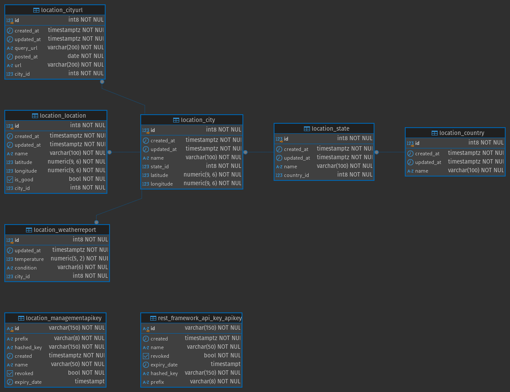
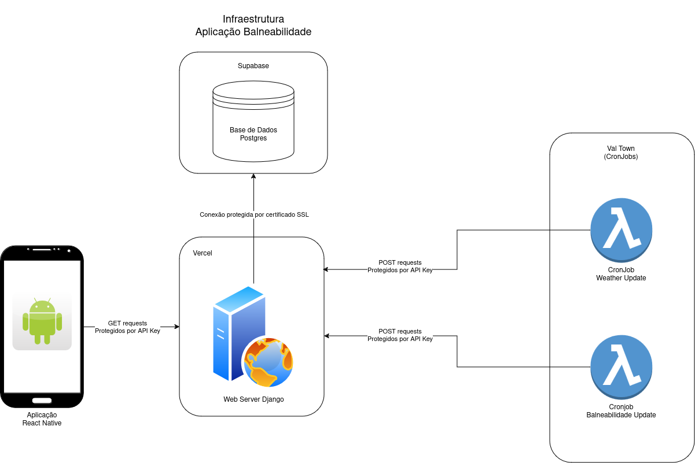

# Balneabilidade Backend

## Requirements

- Python 3.11 or higher
- PostgreSQL Database
- API Key from [OpenWeather](https://home.openweathermap.org/api_keys)

## Run the project

- Install the requirements using pip `pip install -r requirements.txt` (it's recommended to use a virtual environment tool to isolate the project requirements from global packages).
- Create a .env file based on the .env.EXAMPLE file and input the secrets.
- Install the package python-dotenv so the application can read the .env file.
- Run `python manage.py migrate && python manage.py createsuperuser` to initialize the database and create the superuser.
- Run `python manage.py runserver 0.0.0.0:8000` to start the project. It will be available at localhost:8000
- In the admin area `http://localhost:8000/admin/` create a country, state and city, some locations and a API Key (don't forget to store it safely) to allow API access.

## Recommended infrastructure actions

- Use [Vercel](https://vercel.com) to host this app.
- Use [Supabase](https://supabase.com/) for a free database (use the transaction port 5432 instead of the pooler port 6543).
- Use [Val Town](https://www.val.town) to manage cronjobs (located in `./cronjob_scripts`) that will update the Weather and Locations (Celery Beat is an option, but it's not possible to do it in Vercel)

## Documentation

### Entity-relationship diagram

### Infrastructure

## Contributing

Contributions are welcome! Please open an issue or submit a pull request.

## License

This project is licensed under the MIT License.
